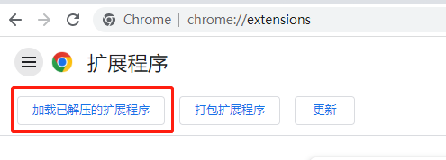

# Chrome插件开发概览
Chrome浏览器扩展程序是一种可以扩展Chrome浏览器功能的软件，它可以通过添加新的界面元素、修改网页内容或实现新的功能等方式来改进用户的浏览体验。

## 开发
打开Chrome浏览器输入：`chrome://extensions/`，打开开发者模式，加载已解压扩展程序，然后找到自己项目文件



## 基本结构目录文件
当我们开始开发一个 Chrome 插件时，需要创建以下基本根目录文件：
```
manifest.json：是 Chrome 插件的配置文件，必须在根目录下，它定义了插件的名称、版本、图标、权限等信息。

background.js：后台脚本，也称为“事件页面”，可以在插件安装时就开始运行。可以监听事件，比如网页加载事件、浏览器关闭事件等。

popup.html 和 popup.js：浏览器插件的弹出窗口，当插件图标被单击时，浏览器将弹出一个窗口，其中可以包含插件的设置和其他信息。

content.js：用于在网页上运行的脚本，可以操作 DOM 和向网页注入 JavaScript 代码。

Options Page - 这是一个 HTML 页面，允许用户自定义插件的一些选项，比如设置、样式、行为等等。

Icons - 插件的图标，用来在浏览器工具栏、菜单和其他地方展示插件的标识符。一般来说，插件需要提供多个尺寸的图标以适应不同的显示设备和分辨率。
```

### manifest.json字段解析 v3
- 例子
```js
{
  "name": "插件名称",
  "version": "插件版本号",
  "manifest_version": 3,
  "description": "插件描述",
  "icons": {
    "16": "图标16x16像素路径",
    "32": "图标32x32像素路径",
    "48": "图标48x48像素路径",
    "128": "图标128x128像素路径"
  },
  "background": {
    "service_worker": "service-worker.js",
  },
  "action": {
    "default_popup": "popup.html",
    "default_icon": {
      "16": "图标16x16像素路径",
      "32": "图标32x32像素路径"
    }
  },
   /**
    * permissions - 包含已知字符串列表中的项目 【只需一次弹框要求允许】
    * host_permissions - 允许使用扩展的域名
    * optional_permissions - 与常规类似permissions，但由扩展的用户在运行时授予，而不是提前授予【安全】
    */
  "permissions": [
    "tabs",
    "activeTab",
    "storage",
  ],
  "host_permissions": ["http://*/*", "https://*/*"],
  "optional_permissions": ["downloads"],
  "content_scripts": [
    {
      "matches": ["<all_urls>"],
      "js": ["content.js"]
    }
  ],
  // 使用/添加devtools中的功能
  "devtools_page": "devtools.html",
}
```
- 字段解析
```
manifest_version：必选字段，指定manifest的版本号，必须为3。
name：必选字段，指定插件的名称。
version：必选字段，指定插件的版本号。
description：可选字段，指定插件的描述。
icons：可选字段，指定插件的图标。格式为一个对象，包含多个不同尺寸的图标路径。
action：可选字段，指定插件的动作。格式为一个对象，包含多个事件处理程序。
permissions：可选字段，指定插件需要的权限。格式为一个数组，包含多个权限字符串，如"tabs"、"storage"等。
host_permissions：可选字段，指定插件需要访问的主机权限。格式为一个数组，包含多个主机匹配字符串。
background：可选字段，指定插件的后台页面。格式为一个对象，包含多个属性，如service_worker、scripts等。
content_scripts：可选字段，指定插件的内容脚本。格式为一个数组，每个元素为一个对象，包含多个属性，如matches、js等。
options_ui：可选字段，指定插件的选项页面。格式为一个对象，包含多个属性，如page、chrome_style等。
devtools：可选字段，指定插件的开发者工具页面。格式为一个对象，包含多个属性，如page、title等。
web_accessible_resources：可选字段，指定插件需要访问的web资源。格式为一个数组，包含多个资源路径字符串。
chrome_settings_overrides：可选字段，指定插件的设置页面。格式为一个对象，包含多个属性，如homepage、search_provider等。
chrome_url_overrides：可选字段，指定插件的Chrome URL重定向页面。格式为一个对象，包含多个属性，如bookmarks、newtab等。
```

### service_worker <-> background.js
负责处理插件的主要逻辑、浏览器、及其他脚本进行通信、数据存储。 **注意：** 无权访问 DOM
```js
chrome.runtime.onInstalled.addListener(function () {
  console.log("插件已被安装");
});
```

### content_script
可以注入到网页中。它们可以访问当前页面的 DOM，比如获取页面内容、修改页面样式、监听页面事件等等
```js
"content_scripts": [{
    // 满足matches匹配的域名
    "matches": ["<all_urls>"],
    // 注入js
    "js": ["content.js"],
    // 注入css
    "css": ["style.css"],
    "run_at": "document_end"
}]
```

### popup.html 和 popup.js
点击插件上弹窗，含html和js操作，当前操作的js只能在html用src引入

### Options Page 
这是一个 HTML 页面，允许用户自定义插件的一些选项，比如设置、样式、行为等等。

## 组成的通信方式
因Chrome设计的模式，server worker不能操作页面dom，popup只能操作自己，content script能操作页面dom，但功能有限。这时候就要用到通信的方式去调用api回传数据来做功能了

- Content Script发送
```js
// 发送
chrome.runtime.sendMessage({ message: "Hello from content script!" });

// 监听接收
chrome.runtime.onMessage.addListener((request, sender, sendResponse) => {
	// 可写成switch形式 监听所有
	if (sender === "") {
		// do something
	}
	if (request.from === "aa") {
		// from 自定义词汇
		// do something
	}
    // 发送回传
	sendResponse({number: request.number});
} 
```

- Service Worker中监听消息并回复
```js
chrome.runtime.onMessage.addListener((message, sender, sendResponse) => {
  console.log("Message from content script:", message);

  // 接收
  chrome.tabs.query({active: true, currentWindow: true}, function (tabs) {
    chrome.tabs.sendMessage(tabs[0].id, {number: request.number + 1}, (response) => {
        console.log(`background -> content script infos have been received. number: ${response.number}`);
    });
});

  // 发送回传
  sendResponse({ message: "Hello from service worker!" });
});
```

- popup，当popup和background时可以直接使用`chrome.runtime.sendMessage`，其它页面视情况1对多或者多对多时用tabs.sendMessage
```js
chrome.tabs.query({active: true, currentWindow: true}, function(tabs) {
  chrome.tabs.sendMessage(tabs[0].id, {action: "addCapture"});
});
```

### contextMenus
自定义浏览器的右键菜单

```js
// 开启权限
"permissions": ["contextMenus"],

// background.js  chrome.runtime.onInstalled中
chrome.contextMenus.create({
  id: "1",
  title: "test Menu",
  contexts: ["all"],
});
// 分割线
chrome.contextMenus.create({
  type: "separator",
});
// 父级菜单
chrome.contextMenus.create({
  id: "2",
  title: "parent c",
  contexts: ["all"],
});
chrome.contextMenus.create({
  id: "21",
  parentId: "2",
  title: "child 1",
  contexts: ["all"],
});
```

### DevTools
可以访问 DevTools API 和一组有限的扩展 API。 
开发类似Vue或者React的devtools。  
DevTools可以为Chrome的DevTools添加功能，它可以添加新的UI面板和侧边栏，与检查的页面交互，获取有关网络请求的信息等等；可访问特定API：
- devtools.inspectedWindow
- devtools.network
- devtools.panels

```js
// manifest.json
"devtools_page": "devtools.html",

// devtools.html
<!DOCTYPE html>
<html lang="en">
  <head> </head>
  <body>
    <script type="text/javascript" src="./devtools.js"></script>
  </body>
</html>
// devtools.js
chrome.devtools.panels.create(
  // 扩展面板显示名称
  "DevPanel",
  // 扩展面板icon，并不展示
  "panel.png",
  // 扩展面板页面
  "Panel.html",
  function (panel) {
    console.log("自定义面板创建成功！");
  }
);

// 创建自定义侧边栏
chrome.devtools.panels.elements.createSidebarPane(
  "Sidebar",
  function (sidebar) {
    sidebar.setPage("sidebar.html");
  }
);

```

## Chrome插件的api
